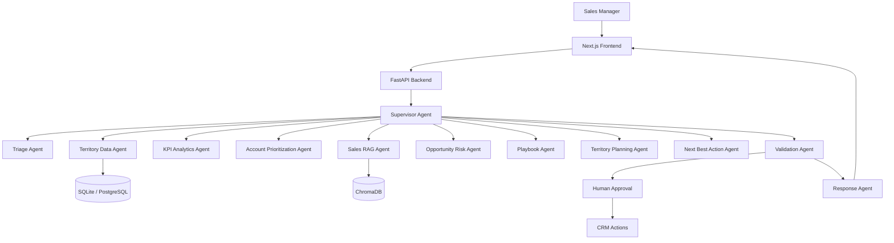

# Agentic Sales Territory Planning Assistant

## Overview
This project delivers a production-style multi-agent sales planning assistant built with a FastAPI backend, LangGraph orchestration, RAG, and a Next.js dashboard for local prototyping and extended enterprise deployment.

## Business Problem
Sales organizations need consistent prioritization across territories, rapid account analysis, and evidence-backed recommendations. Manual analysis is slow, inconsistent, and difficult to scale across large portfolios.

## Key Features
- Multi-agent orchestration with LangGraph
- Territory and account retrieval tools
- KPI analytics and deterministic scoring
- RAG-powered sales policy retrieval with citations
- Account prioritization and risk review
- Territory planning and next-best-action recommendations
- Human approval guardrail flow
- Docker and Vercel-ready architecture

## Architecture


## Local Setup

### Python backend
1. Create a virtual environment
2. Install dependencies:
   `pip install -r requirements.txt`
3. Start the API:
   `uvicorn backend.app.main:app --reload`

### Frontend
1. Install dependencies:
   `cd frontend && npm install`
2. Start the UI:
   `npm run dev`

### Environment
Copy [.env.example](.env.example) to `.env` and set your values.

## Database and vector setup
- SQLite is used by default for local development.
- Chroma is used for local knowledge retrieval.
- Redis and PostgreSQL are supported in docker-compose for later deployment. 

## API endpoints
- GET /api/health
- GET /api/metrics
- POST /api/chat
- POST /api/agent/run
- POST /api/territories/analyze
- POST /api/territories/plan
- POST /api/accounts/prioritize
- POST /api/accounts/analyze
- POST /api/documents/upload
- POST /api/documents/ingest

## Sample request
```json
{
  "user_query": "Create a territory plan for Territory T001 and identify the top 10 accounts that should receive attention this quarter.",
  "session_id": "session-123",
  "user_id": "user-456"
}
```

## Sample response
```json
{
  "workflow": "8b8d0f17-e8ef-48f7-a084-5a0e5437d8c3",
  "response": "Territory plan for T001 is ready. Priority accounts: ACC1001, ACC2001, ACC1002.",
  "status": "ok"
}
```

## Docker
```bash
docker compose up --build
```

## Testing
```bash
pytest -q
```

## Notes
This repository is intentionally structured so that the core orchestration, tools, retrieval, and UI can be extended into a full enterprise deployment without replacing the underlying modular design.
