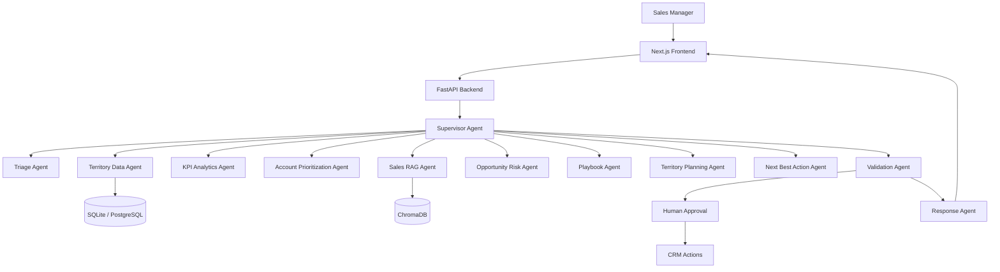

# Agentic Sales Territory Planning Assistant

## Overview
This project delivers a production-style multi-agent sales planning assistant built with a FastAPI backend, LangGraph orchestration, RAG, and a Next.js dashboard for local prototyping and extended enterprise deployment.

## Business Problem
Sales organizations need consistent prioritization across territories, rapid account analysis, and evidence-backed recommendations. Manual analysis is slow, inconsistent, and difficult to scale across large portfolios.

## Key Features
- Multi-agent orchestration with LangGraph
- Territory and account retrieval tools
- KPI analytics and deterministic scoring
- RAG-powered sales policy retrieval with citations
- Account prioritization and risk review
- Territory planning and next-best-action recommendations
- Human approval guardrail flow
- Plan lifecycle API with versioning, approval, rejection and audit trail
- Deterministic compliance checks (ownership, access, contact policy, evidence)
- Configurable ranking rules, data-freshness flagging and idempotent CRM export
- Correlation-ID observability with structured logs
- Docker and Vercel-ready architecture

## Architecture


## Local Setup

### Python backend
1. Create a virtual environment
2. Install dependencies:
   `pip install -r requirements.txt`
3. Start the API:
   `uvicorn backend.app.main:app --reload`

### Frontend
1. Install dependencies:
   `cd frontend && npm install`
2. Start the UI:
   `npm run dev`

### Run scripts
From the project root.

Windows (PowerShell / cmd):
- Backend: `.\run-backend.bat` → http://localhost:8000 (interactive docs at `/docs`)
- Frontend: `.\run-frontend.bat` → http://localhost:3000

macOS / Linux / Git Bash:
- Backend: `./run-backend.sh` → http://localhost:8000 (interactive docs at `/docs`)
- Frontend: `./run-frontend.sh` → http://localhost:3000
- Both together: `./run-all.sh` (Ctrl+C stops both)

The backend scripts prefer a project `.venv`, then fall back to a Python interpreter that already has the dependencies (`py -3.12`, `py -3.11`, or `python`). They honour `HOST`, `PORT`, and `RELOAD` (set `RELOAD=0` to disable auto-reload).

### Environment
Copy [.env.example](.env.example) to `.env` and set your values.

Frontend: the browser calls the backend at `NEXT_PUBLIC_API_URL`. It defaults to
`http://localhost:8000` in [frontend/lib/api.ts](frontend/lib/api.ts), and is set explicitly in
`frontend/.env.local` (see [frontend/.env.example](frontend/.env.example)). The run scripts also
default it. If you change the backend port, update `NEXT_PUBLIC_API_URL` and restart the dev server
— because `NEXT_PUBLIC_*` values are inlined at build time, a stale value will persist until the
`.next` cache is cleared.

## Database and vector setup
- SQLite is used by default for local development.
- Chroma is used for local knowledge retrieval.
- Redis and PostgreSQL are supported in docker-compose for later deployment. 

## API endpoints

### Plan-centric API (PRD)

The plan API implements the human-in-the-loop territory plan lifecycle: draft,
review, edit, approve/reject, export and audit. All bodies are validated with
Pydantic; mutating endpoints accept an `Idempotency-Key` header.

- POST `/v1/plans` — request a new territory plan (`territory_id`, `user_id`, optional `filters`)
- GET `/v1/plans` — list plan summaries
- GET `/v1/plans/{plan_id}` — plan contents, validation results and compliance
- PATCH `/v1/plans/{plan_id}` — edit plan items before approval
- POST `/v1/plans/{plan_id}/approve` — approve all or selected items (manager only)
- POST `/v1/plans/{plan_id}/reject` — reject plan or items with a reason
- POST `/v1/plans/{plan_id}/export?format=csv|json` — export approved actions (idempotent)
- GET `/v1/plans/{plan_id}/audit` — audit trail (creator, editor, approver, exports)
- GET `/v1/scoring-rules`, PUT `/v1/scoring-rules` — inspect/update ranking weights (Sales Ops)
- GET `/health` — liveness and readiness

### Workflow API
- GET /api/health
- GET /api/metrics
- POST /api/chat
- POST /api/agent/run
- POST /api/territories/analyze
- POST /api/territories/plan
- POST /api/accounts/prioritize
- POST /api/accounts/analyze
- POST /api/documents/upload
- POST /api/documents/ingest

## Plan lifecycle and guardrails
- **Permission filtering**: retrieval returns only accounts the requesting user is authorized
  to see; unauthorized records never reach drafting or the LLM.
- **Deterministic scoring**: ranking factors (opportunity value, past performance, product
  adoption, service issues, opportunity stage, territory rules) are computed in Python. Weights
  and thresholds live in [`backend/app/config/scoring_rules.json`](backend/app/config/scoring_rules.json)
  and can be updated at runtime via `PUT /v1/scoring-rules`.
- **Compliance checks**: ownership, access authorization, contact policy, evidence and required
  fields are checked deterministically for every item.
- **Freshness**: records older than `DATA_FRESHNESS_THRESHOLD_DAYS` (default 30) are flagged as
  stale and never guessed at.
- **Human approval**: only a `SALES_MANAGER` may approve; every decision records user, timestamp
  and plan version.
- **Idempotent export**: re-exporting an unchanged approved plan returns the original export.
- **Observability**: every response carries `X-Correlation-ID` and requests are logged as
  structured events.

> Note: authentication is stubbed with the in-memory user directory above (`user_id` in request
> bodies) so the approval and permission rules are demonstrable locally. Replace it with the
> existing identity provider for deployment.

### Demo identities (`user_id`)

| user_id | role | territory access |
| --- | --- | --- |
| `mgr-001` | SALES_MANAGER | T001 |
| `mgr-002` | SALES_MANAGER | T002 |
| `mgr-003` | SALES_MANAGER | T003 |
| `rep-042` | SALES_REP | ACC1001, ACC1002 |
| `ops-001` | SALES_OPS | all (read) |
| `audit-001` | AUDITOR | all (read) |

### Plan example
```bash
curl -X POST http://localhost:8000/v1/plans \
  -H "Content-Type: application/json" \
  -d '{"territory_id":"T001","user_id":"mgr-001"}'

curl -X POST http://localhost:8000/v1/plans/<plan_id>/approve \
  -H "Content-Type: application/json" \
  -H "Idempotency-Key: approve-1" \
  -d '{"user_id":"mgr-001"}'

curl -X POST "http://localhost:8000/v1/plans/<plan_id>/export?format=csv"
```

## Sample request
```json
{
  "user_query": "Create a territory plan for Territory T001 and identify the top 10 accounts that should receive attention this quarter.",
  "session_id": "session-123",
  "user_id": "user-456"
}
```

## Sample response
```json
{
  "workflow": "8b8d0f17-e8ef-48f7-a084-5a0e5437d8c3",
  "response": "Territory plan for T001 is ready. Priority accounts: ACC1001, ACC2001, ACC1002.",
  "status": "ok"
}
```

## Docker
```bash
docker compose up --build
```

## Testing
```bash
pytest -q
```

## Notes
This repository is intentionally structured so that the core orchestration, tools, retrieval, and UI can be extended into a full enterprise deployment without replacing the underlying modular design.
